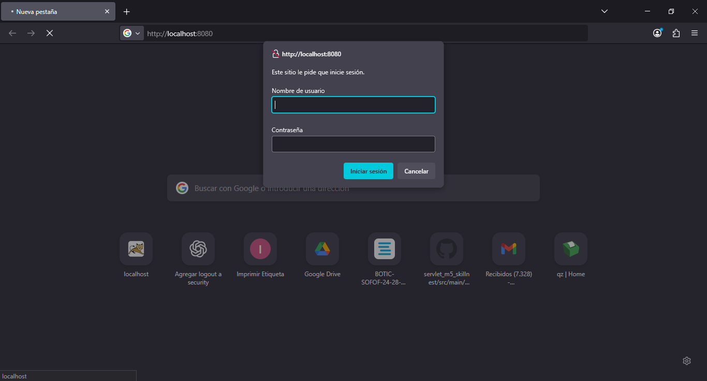
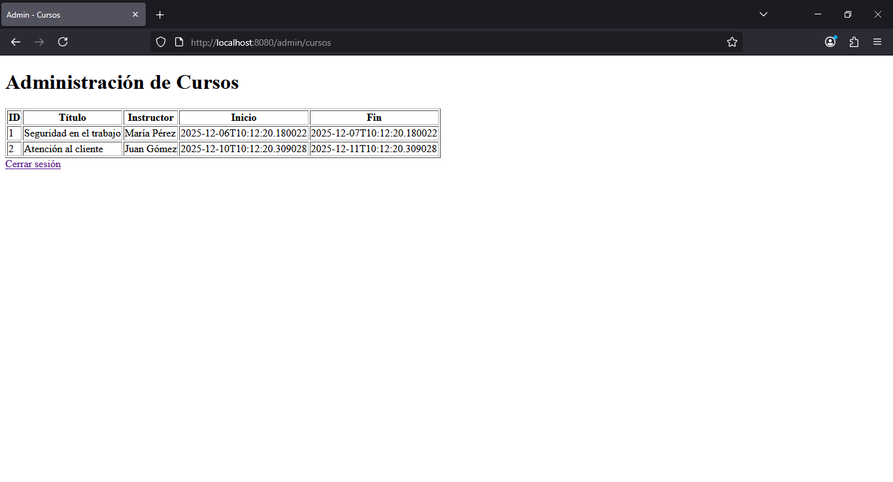
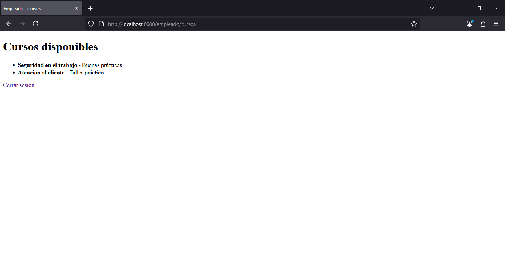
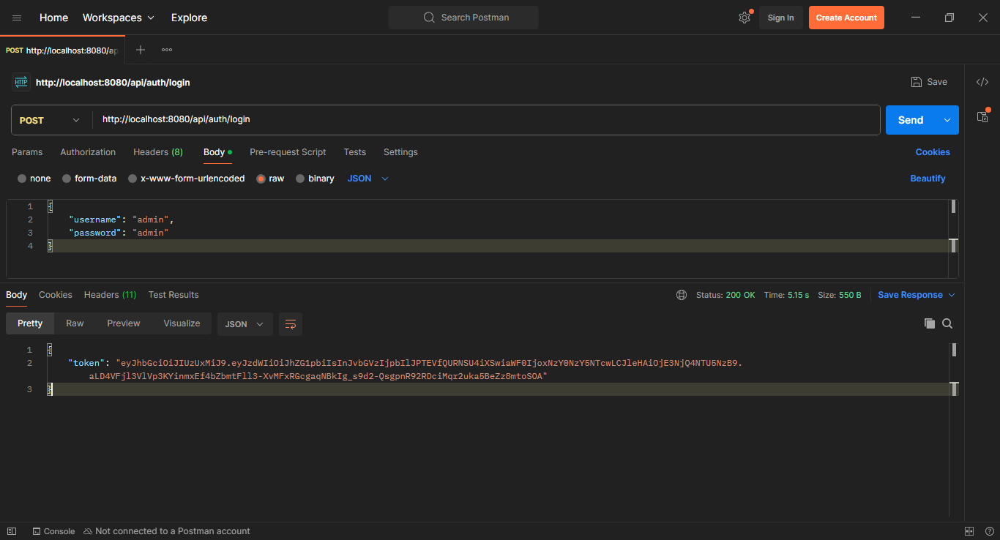
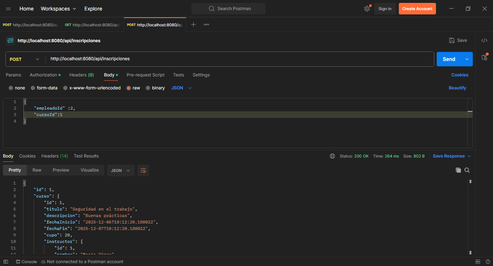
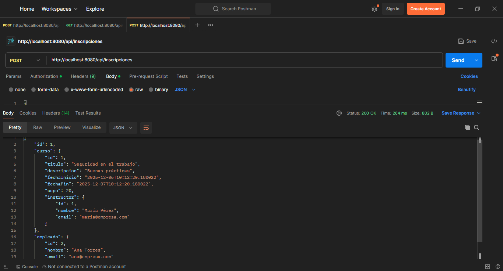
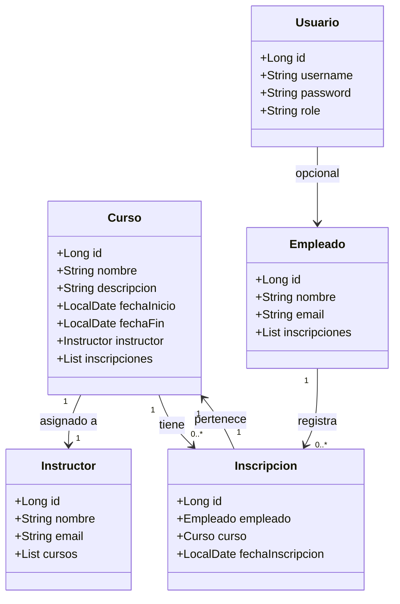
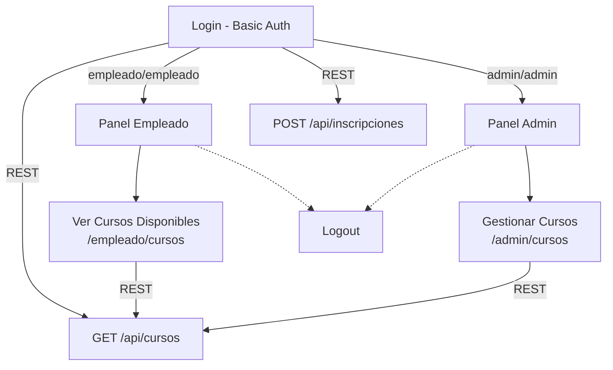

# Sistema de Gestión de Capacitaciones (Spring Boot)

## Contexto del Proyecto

Formas parte del equipo de desarrollo de un sistema interno para una empresa que gestiona capacitaciones de personal. Se te ha encargado desarrollar una aplicación web en Spring Boot que permita:

* Registrar cursos de capacitación
* Gestionar instructores y empleados inscritos
* Permitir autenticación y autorización con roles de usuario (admin y empleado)
* Exponer servicios REST para integrar con otros sistemas internos
* Administrar el proyecto utilizando un gestor como Trello, Jira o GitHub Projects

## Requerimientos de la Aplicación

1. Panel de administración para gestionar cursos y asignar instructores
2. Panel de empleado para ver los cursos disponibles e inscribirse
3. Login con autenticación por rol (Spring Security)
4. Servicios REST para:
	- Consultar cursos disponibles
	- Registrar empleados a cursos
5. Acceso restringido a los endpoints según el rol
6. Administración del ciclo de vida del proyecto con tareas y sprints

## Instrucciones
1. Gestión del ciclo de vida del proyecto con un gestor de tareas

* Crea un tablero en Trello, Jira o GitHub Projects.
* Agrega columnas como: Backlog, To Do, In Progress, Done
* Define tareas para cada funcionalidad del proyecto.
* Asigna tareas por roles y agrupa por etapas (planificación, desarrollo, pruebas, despliegue).
* Toma capturas del tablero en diferentes momentos del avance.

2. Implementación con Spring Boot y Spring MVC

* Inicializa el proyecto con Spring Initializr (usa Maven o Gradle).
* Agrega las dependencias necesarias: ***spring-boot-starter-web spring-boot-starter-data-jpa spring-boot-starter-security spring-boot-starter-thymeleaf (opcional)***
* Implementa controladores que gestionen vistas con Spring MVC:
  	- /admin/cursos: Vista para gestionar cursos
	- /empleado/cursos: Vista para ver cursos disponibles

3. Capa de acceso a datos (Spring Data JPA)

* Crea entidades: Curso, Empleado, Instructor, Inscripcion
* Crea interfaces de repositorio extendiendo JpaRepository
* Usa base de datos H2, PostgreSQL o MySQL
* Aplica relaciones entre entidades (OneToMany, ManyToOne, etc.)

4. Seguridad con Spring Security

* Implementa sistema de login con usuarios y roles: ADMIN, EMPLEADO
* Protege rutas:
	- /admin/** accesibles solo para ADMIN
	- /empleado/** accesibles para usuarios autenticados con rol EMPLEADO
* Configura WebSecurityConfigurerAdapter (o SecurityFilterChain si usas Spring Security 6+)

5. Servicios REST para interoperabilidad

* Expón endpoints REST para:
	- GET /api/cursos: Devuelve el listado de cursos disponibles
	- POST /api/inscripciones: Registra a un empleado en un curso
* Configura el controlador REST (@RestController)
* Asegura los endpoints con JWT o Basic Auth
* Usa @CrossOrigin si deseas permitir peticiones desde clientes externos

## Producto Esperado

* Proyecto completo en Spring Boot con:
	- Controladores Web y REST
	- Repositorios JPA
_ Seguridad implementada
* Tablero con tareas en gestor de proyecto
* Base de datos con relaciones funcionando
* Rutas protegidas por roles
* Documentación con:
	- Diagrama de clases
	- Diagrama del flujo de navegación
	- Evidencia del uso del gestor de proyecto
	- Instrucciones para ejecutar el proyecto (README.md)

### Ejecución del Proyecto

## 1. Requisitos
Java 17 o superior
Maven 3+
Internet para descargar dependencias

## 2. Clonar y ejecutar
```
git clone https://github.com/frherrer/BootCamp-JavaSpring-Capacitaciones
cd capacitaciones
mvn spring-boot:run
```

La aplicación se inicia en:
```
http://localhost:8080
```

## 3. Base de Datos

No se requiere crear manualmente la base de datos.

✔La BD se crea automáticamente gracias a:
```
spring.jpa.hibernate.ddl-auto=update
```
Editar `src/main/resources/application.properties` y poner los datos de conexión a la base de datos. Ejemplo:

   ```properties
   spring.datasource.url=jdbc:mysql://localhost:3306/capacitaciones
   spring.datasource.username=tu_usuario
   spring.datasource.password=tu_contraseña
   ```
   
También incluye un DataLoader que carga automáticamente:

* 1 usuario admin
* 1 usuario empleado
* Cursos de ejemplo

## 4.Acceso al Sistema
**Login estándar (ventana emergente del navegador)**

Spring Security solicitará usuario y contraseña mediante **Basic Auth**.

Credenciales:
| Rol           | Usuario    | Contraseña |
| ------------- | ---------- | ---------- |
| Administrador | `admin`    | `admin`    |
| Empleado      | `empleado` | `empleado` |



## 5. Vistas del Sistema

**Panel del Administrador**
```
http://localhost:8080/admin/cursos
```

Permite:
* Listar cursos


**Panel del Empleado**
```
http://localhost:8080/empleado/cursos
```
Permite:

* Ver cursos disponibles


## 6.APIs REST (para Postman o integración externa)

Primero es necesario solicitar el token de autentificación
```
POST http://localhost:8080/api/auth/login

{
"username": "admin",
"password": "admin"
}
```


### 1. Listar cursos disponibles
```
GET http://localhost:8080/api/cursos
```

Requiere Basic Auth → usar usuario según rol.

Ejemplo respuesta:
```
[
  { "id": 1, "nombre": "Seguridad Laboral", "vacantes": 20 },
  { "id": 2, "nombre": "Primeros Auxilios", "vacantes": 15 }
]
```

### 2. Registrar empleado a un curso
```
POST http://localhost:8080/api/inscripciones

Body JSON:
{
  "empleadoId": 2,
  "cursoId": 1
}

Respuesta:
{
  "id": 10,
  "empleadoId": 2,
  "cursoId": 1,
  "fechaInscripcion": "2025-12-03T23:00:14.829Z"
}
```


📌

## Diagrama de Clases


## Diagrama del Flujo de Navegación

